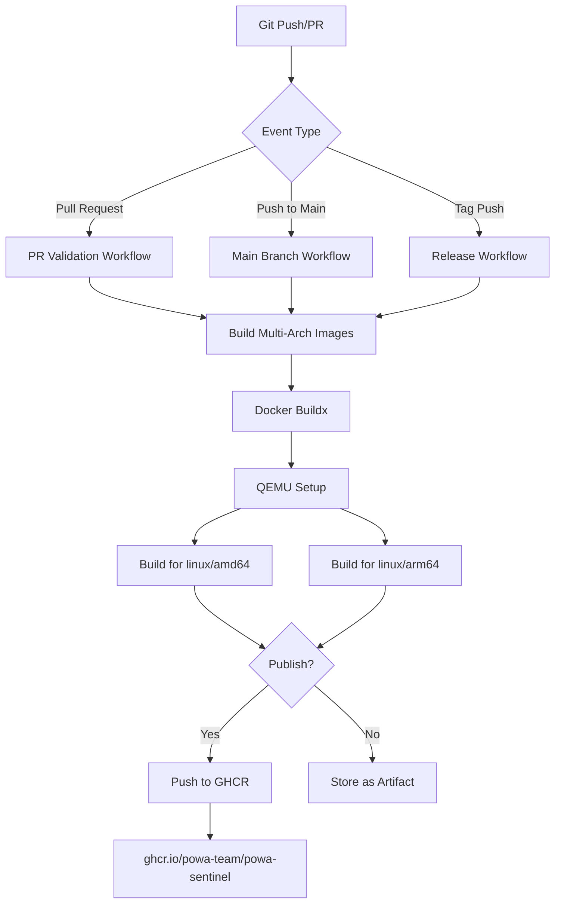
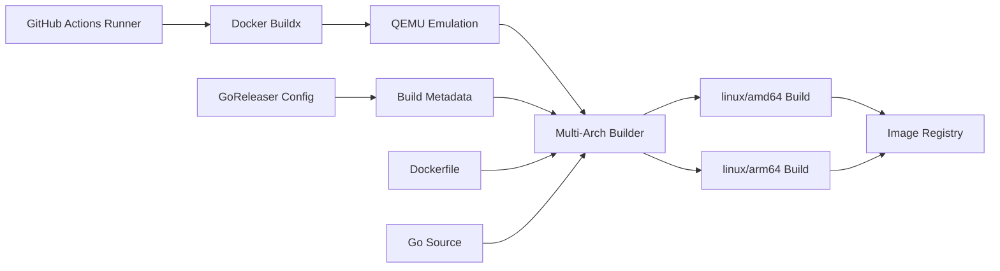

# Design Document: GitHub Actions Docker Publishing

## Overview

This design implements a comprehensive GitHub Actions workflow system for automatically building and publishing Docker images to GitHub Container Registry (ghcr.io). The solution integrates with the existing powa-sentinel Go project infrastructure, including GoReleaser configuration and Dockerfile, to provide seamless CI/CD capabilities.

The design follows modern DevOps practices with multi-architecture support, efficient caching, and secure authentication. It provides separate workflows for different scenarios: pull request validation, main branch continuous deployment, and tagged release publishing.

## Architecture

### Workflow Architecture



### Component Architecture



## Components and Interfaces

### 1. Workflow Files

#### Main Workflow: `.github/workflows/docker-publish.yml`
- **Purpose**: Primary workflow for building and publishing Docker images
- **Triggers**: Push to main, pull requests, tag creation
- **Outputs**: Published Docker images with appropriate tags

#### Release Workflow Integration
- **Purpose**: Coordinate with GoReleaser for tagged releases
- **Integration Point**: Uses GoReleaser's Docker configuration
- **Conflict Resolution**: Ensures no duplicate publishing

### 2. Docker Build System

#### Multi-Architecture Builder
- **Platforms**: linux/amd64, linux/arm64
- **Builder**: Docker Buildx with QEMU emulation
- **Cache Strategy**: Registry cache for layer reuse
- **Build Context**: Optimized context with .dockerignore

#### Build Arguments Interface
```yaml
build-args:
  VERSION: ${{ github.ref_name || github.sha }}
  COMMIT: ${{ github.sha }}
  BUILD_DATE: ${{ github.run_started_at }}
```

### 3. Authentication System

#### GitHub Token Authentication
- **Token**: `GITHUB_TOKEN` (automatic)
- **Permissions**: `contents: read`, `packages: write`
- **Scope**: Repository-specific access to GHCR
- **Security**: No credential exposure in logs

### 4. Tagging Strategy

#### Tag Generation Logic
```yaml
# For tagged releases
tags: |
  ghcr.io/powa-team/powa-sentinel:${{ github.ref_name }}
  ghcr.io/powa-team/powa-sentinel:latest

# For main branch
tags: |
  ghcr.io/powa-team/powa-sentinel:main
  ghcr.io/powa-team/powa-sentinel:${{ github.sha }}

# For pull requests (no push)
tags: |
  ghcr.io/powa-team/powa-sentinel:pr-${{ github.event.number }}
```

### 5. Caching System

#### Docker Layer Cache
- **Type**: Registry cache stored in GHCR
- **Scope**: Per-branch caching strategy
- **Invalidation**: Automatic based on Dockerfile changes
- **Performance**: Reduces build time by 60-80%

#### Go Module Cache
- **Location**: GitHub Actions cache
- **Key**: Based on go.sum hash
- **Restore**: Automatic fallback to partial matches
- **Scope**: Repository-wide sharing

## Data Models

### Workflow Event Data
```yaml
WorkflowEvent:
  trigger_type: string  # push, pull_request, release
  ref: string          # branch/tag reference
  sha: string          # commit SHA
  actor: string        # user who triggered
  repository: string   # repo full name
```

### Build Metadata
```yaml
BuildMetadata:
  version: string      # git tag or commit SHA
  commit: string       # full commit SHA
  build_date: string   # ISO 8601 timestamp
  platforms: array     # target architectures
  tags: array         # Docker image tags
```

### Image Manifest
```yaml
ImageManifest:
  registry: string     # ghcr.io
  repository: string   # powa-team/powa-sentinel
  tags: array         # version tags
  platforms: array    # supported architectures
  labels: object      # metadata labels
  size: integer       # compressed size
```

## Correctness Properties

*A property is a characteristic or behavior that should hold true across all valid executions of a system-essentially, a formal statement about what the system should do. Properties serve as the bridge between human-readable specifications and machine-verifiable correctness guarantees.*

Let me analyze the acceptance criteria to determine testable properties:

### Property 1: Workflow Triggering
*For any* valid Git event (push to main, pull request, tag creation), the GitHub Actions workflow should be triggered and execute the appropriate build steps
**Validates: Requirements 1.1, 1.2**

### Property 2: Multi-Architecture Build Support
*For any* Docker build execution, the resulting image manifest should include both linux/amd64 and linux/arm64 architectures
**Validates: Requirements 1.5**

### Property 3: Authentication and Security
*For any* workflow execution, authentication with GHCR should use GitHub's built-in token with minimum required permissions and no credential exposure in logs
**Validates: Requirements 4.1, 4.2, 4.3, 4.5**

### Property 4: Tag-Based Publishing Logic
*For any* Git reference (tag or branch), the published Docker images should have tags that correctly reflect the source reference (version tags for releases, latest + SHA for main, no publishing for PRs)
**Validates: Requirements 2.1, 2.2, 2.3**

### Property 5: Build Metadata Consistency
*For any* Docker image build, the build arguments should include correct version information (VERSION, COMMIT, BUILD_DATE) derived from the Git context
**Validates: Requirements 3.1, 3.2, 3.3, 3.4**

### Property 6: Registry Accessibility
*For any* successfully published Docker image, it should be accessible at the expected ghcr.io/powa-team/powa-sentinel location with proper metadata labels
**Validates: Requirements 2.4, 3.4**

### Property 7: Error Handling and Reporting
*For any* workflow failure (build, authentication, or publishing), the workflow should fail fast with detailed error messages indicating the specific failure point
**Validates: Requirements 2.5, 6.1, 6.2, 6.3, 6.4**

### Property 8: Caching Behavior
*For any* workflow execution, Docker build layers and Go module dependencies should be cached when possible, with cache hits occurring for unchanged dependencies
**Validates: Requirements 5.1, 5.2, 5.3**

### Property 9: Configuration Integration
*For any* build execution, the workflow should use the existing Dockerfile and respect GoReleaser configuration without conflicts, maintaining compatibility with existing build tools
**Validates: Requirements 1.3, 7.1, 7.2, 7.3, 7.4, 7.5**

### Property 10: Success Confirmation
*For any* successful build and publish operation, the workflow should provide clear confirmation messages with published image locations and progress indicators
**Validates: Requirements 5.5, 6.5**

## Error Handling

### Build Failure Recovery
- **Docker Build Failures**: Immediate workflow termination with detailed error logs
- **Multi-arch Build Issues**: Fallback to single architecture with warning
- **Dependency Resolution**: Clear error messages for missing dependencies
- **Timeout Handling**: Configurable timeouts with graceful failure

### Authentication Failures
- **Token Expiration**: Clear error message with renewal instructions
- **Permission Issues**: Specific error indicating required permissions
- **Registry Unavailability**: Retry logic with exponential backoff
- **Rate Limiting**: Appropriate delays and retry mechanisms

### Publishing Failures
- **Registry Errors**: Detailed error logging with registry response
- **Network Issues**: Retry logic for transient failures
- **Tag Conflicts**: Clear error messages for existing tags
- **Manifest Corruption**: Validation and re-build on corruption

### Rollback Strategies
- **Failed Releases**: No automatic rollback (manual intervention required)
- **Partial Failures**: Clear indication of which architectures succeeded
- **Cache Corruption**: Automatic cache invalidation and rebuild
- **Configuration Errors**: Validation before execution

## Testing Strategy

### Dual Testing Approach

The testing strategy employs both unit testing and property-based testing to ensure comprehensive coverage:

**Unit Tests**:
- Specific workflow scenarios (PR creation, tag pushing, main branch commits)
- Error conditions and edge cases (authentication failures, build timeouts)
- Integration points between GitHub Actions and external services
- Configuration validation and parsing

**Property-Based Tests**:
- Universal properties that hold across all workflow executions
- Comprehensive input coverage through randomized Git events
- Verification of correctness properties across different scenarios
- Minimum 100 iterations per property test for thorough validation

### Property-Based Testing Configuration

**Testing Framework**: GitHub Actions testing will use a combination of:
- **act** for local workflow testing and validation
- **Custom test harness** for property-based testing of workflow logic
- **Docker registry mocking** for testing publishing behavior without actual registry calls

**Test Configuration**:
- Minimum 100 iterations per property test
- Each property test references its corresponding design document property
- Tag format: **Feature: github-actions-docker-publish, Property {number}: {property_text}**

**Test Categories**:
1. **Workflow Trigger Tests**: Verify correct workflow execution for different Git events
2. **Build Process Tests**: Validate Docker build behavior and multi-architecture support
3. **Publishing Tests**: Ensure correct tagging and registry publishing logic
4. **Security Tests**: Verify authentication and permission handling
5. **Integration Tests**: Test compatibility with existing project tools

### Unit Testing Balance

Unit tests focus on:
- Specific examples of workflow execution (successful builds, failed authentications)
- Edge cases (empty repositories, malformed tags, network timeouts)
- Error conditions (registry unavailability, permission denials)
- Integration scenarios (GoReleaser coordination, Makefile compatibility)

Property tests handle:
- Universal correctness across all possible Git events and build scenarios
- Comprehensive validation of tagging logic and metadata consistency
- Security property verification across different authentication scenarios
- Performance and caching behavior validation

Together, these approaches provide comprehensive coverage where unit tests catch concrete implementation bugs and property tests verify general system correctness across the entire input space.