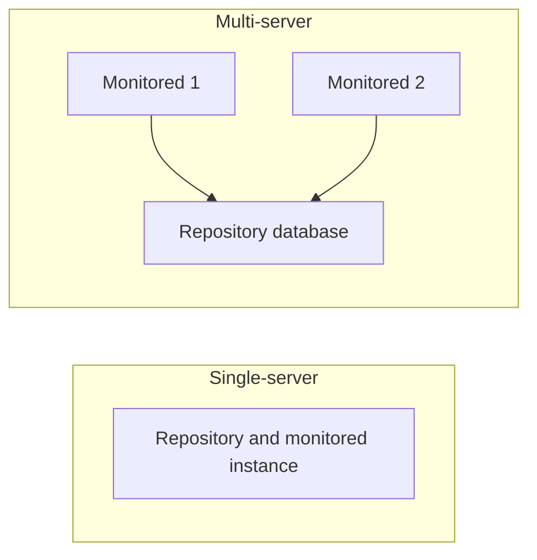

# PoWA Schema Reference

Context on [PoWA](https://github.com/powa-team/powa) and the data schema used by powa-sentinel.

## Overview

PoWA is a PostgreSQL Workload Analyzer. powa-sentinel acts as a sidecar: it queries **aggregations** produced by PoWA, not raw PostgreSQL stats. This minimizes overhead and aligns with what DBAs see in the PoWA UI.

## Terminology {#terminology}

| Term | Definition |
| ---- | ---------- |
| **PoWA repository database** | The PostgreSQL instance where PoWA stores history (schema `powa`). powa-sentinel connects **only** to this database. Also called *repository* or *repository database* in this project. |
| **Monitored PostgreSQL instance(s)** | The instance(s) from which PoWA collects `pg_stat_statements` and other stats; there may be one or many. |
| **Single-server** (e.g. PoWA 3.x) | The repository database and the monitored instance are the **same** PostgreSQL instance. |
| **Multi-server** (e.g. PoWA 4.x) | One **repository database** (central); multiple **monitored instances**. Install `pg_stat_statements` on each monitored instance; the `powa` extension and optional extensions live only on the repository. |

### Deployment modes

- **Single-server**: Repository = monitored instance. All extensions (`pg_stat_statements`, `powa`, and optional ones) are on this single instance.
- **Multi-server**: Repository is a separate central host. Install and register `powa` and optional extensions on the **repository database** only. Install `pg_stat_statements` on **each** monitored instance.

## PoWA Ecosystem

| Component | Role | Relation to powa-sentinel |
| --------- | ---- | -------------------------- |
| **powa-archivist** | Background worker, stores data in `powa` schema | powa-sentinel connects to this DB |
| **powa-web** | Web UI for visualization | Parallel; powa-sentinel for automated alerting |
| **pg_stat_statements** | Query execution stats | Mandatory |
| **pg_stat_kcache** | CPU/IO metrics | Optional |
| **pg_qualstats** | Index suggestions | Optional |

## Key Concepts

- **Repository database**: See [Terminology](#terminology) for the formal definition (PoWA repository database).
- **Snapshot**: PoWA collects stats periodically (default every 5 minutes)
- **Aggregation**: Data aggregated by time windows

## Data Dictionary

### powa_statements (view)

| Field | Type | Description |
| ----- | ---- | ----------- |
| `queryid` | bigint | Normalized query identifier |
| `query` | text | Normalized query text |
| `calls` | bigint | Execution count |
| `total_time` | double | Total execution time (ms) |
| `mean_time` | double | Mean time per call (ms) |
| `ts` | timestamp | Snapshot/aggregation window time |

### powa_statements_history (table/view)

Historical aggregated stats for trends and regression.

**Cumulative counters**: History rows store **cumulative** values from `pg_stat_statements` (and similarly for kcache history). To get “calls” or “total time” **in a time period**, consumers must compute the **delta** (value at end of window minus value at start of window), not sum the rows. Resetting stats (e.g. `pg_stat_statements_reset()`) during a window can make that period’s delta unreliable.

| Field | Type | Usage |
| ----- | ---- | ----- |
| `queryid` | bigint | Join with powa_statements |
| `ts` / `coalesce_range` | timestamp/tstzrange | Time-series filtering |
| `calls` | bigint | Volume analysis (use delta for period) |
| `total_time` | double | Performance analysis (use delta for period) |
| `mean_time` | double | Regression calculation (baseline) |

### powa_databases

| Field | Type | Description |
| ----- | ---- | ----------- |
| `dbid` | oid | Database OID |
| `datname` | text | Database name |

## Supported Extensions

- **pg_stat_kcache**: CPU/IO-based slow query analysis
- **pg_qualstats**: Missing index suggestions (passive read)
- **pg_wait_sampling**: Future support for lock-related alerts

## See also

- [PoWA Version Compatibility](compatibility.md) — supported PoWA versions (3.x, 4.x; 5.x best-effort) and per-version notes
