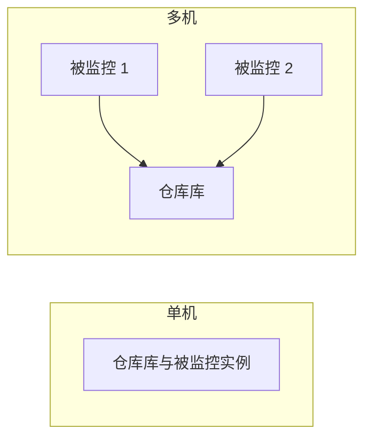

# PoWA Schema 参考

[PoWA](https://github.com/powa-team/powa) 简介及 powa-sentinel 使用的数据 schema。

## 概述

PoWA 是 PostgreSQL 工作负载分析器。powa-sentinel 作为 sidecar：查询 PoWA 已产生的 **聚合数据**，而非原始 PostgreSQL 统计。这样可降低开销，并与 DBA 在 PoWA UI 中看到的数据一致。

## 术语 {#terminology}

| 术语 | 定义 |
| ---- | ---- |
| **PoWA 仓库数据库** | PoWA 存储历史的 PostgreSQL 实例（schema `powa`）。powa-sentinel **只连接**此库。本项目中也可简称「仓库库」或「PoWA 库」。 |
| **被监控的 PostgreSQL 实例** | PoWA 从此处采集 `pg_stat_statements` 等统计；可能为一台或多台。 |
| **单机部署**（如 PoWA 3.x） | 仓库库与被监控实例为**同一** PostgreSQL 实例。 |
| **多机部署**（如 PoWA 4.x） | **一个**仓库库（中心库）；**多台**被监控实例。`pg_stat_statements` 装在被监控实例上；`powa` 扩展及可选扩展仅在仓库库。 |

### 部署模式

- **单机**：仓库库 = 被监控实例。所有扩展（`pg_stat_statements`、`powa` 及可选）均在同一实例。
- **多机**：仓库库为单独的中心主机。仅在**仓库库**上安装并注册 `powa` 及可选扩展。在**每台**被监控实例上安装 `pg_stat_statements`。

## PoWA 生态

| 组件 | 作用 | 与 powa-sentinel 关系 |
| ---- | ---- | ---------------------- |
| **powa-archivist** | 后台 worker，将数据存入 `powa` schema | powa-sentinel 连接此 DB |
| **powa-web** | Web 可视化 UI | 并列；powa-sentinel 负责自动告警 |
| **pg_stat_statements** | 查询执行统计 | 必需 |
| **pg_stat_kcache** | CPU/IO 指标 | 可选 |
| **pg_qualstats** | 索引建议 | 可选 |

## 关键概念

- **仓库数据库**：正式定义见 [术语](#terminology)（PoWA 仓库数据库）。
- **快照**：PoWA 定期采集（默认 5 分钟）
- **聚合**：按时间窗口聚合

## 数据字典

### powa_statements (view)

| 字段 | 类型 | 说明 |
| ---- | ---- | ---- |
| `queryid` | bigint | 归一化查询 ID |
| `query` | text | 归一化查询文本 |
| `calls` | bigint | 执行次数 |
| `total_time` | double | 总执行时间（ms） |
| `mean_time` | double | 单次平均时间（ms） |
| `ts` | timestamp | 快照/聚合窗口时间 |

### powa_statements_history (table/view)

历史聚合统计，用于趋势与回归分析。

| 字段 | 类型 | 用途 |
| ---- | ---- | ---- |
| `queryid` | bigint | 与 powa_statements 关联 |
| `ts` / `coalesce_range` | timestamp/tstzrange | 时间序列过滤 |
| `calls` | bigint | 调用量分析 |
| `total_time` | double | 性能分析 |
| `mean_time` | double | 回归计算（基线） |

### powa_databases

| 字段 | 类型 | 说明 |
| ---- | ---- | ---- |
| `dbid` | oid | 数据库 OID |
| `datname` | text | 数据库名 |

## 支持扩展

- **pg_stat_kcache**：基于 CPU/IO 的慢查询分析
- **pg_qualstats**：缺失索引建议（只读）
- **pg_wait_sampling**：后续支持锁相关告警

## 相关文档

- [PoWA 版本兼容性](compatibility.md) — 支持的 PoWA 版本（3.x、4.x；5.x 最佳-effort）及各版本说明
